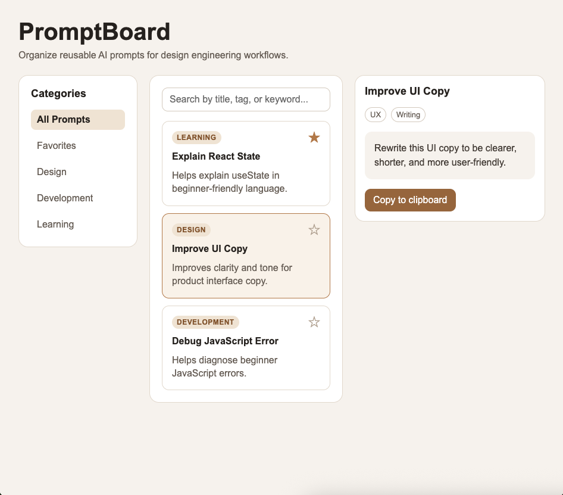
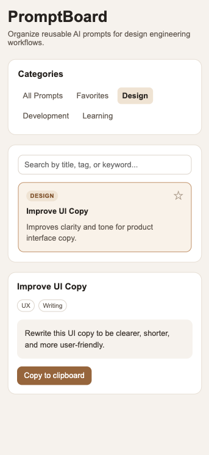

# PromptBoard

PromptBoard is a React frontend prototype for browsing, filtering, favoriting, and copying reusable AI prompts.

It was built as part of a 1-week design engineering sprint focused on improving React fundamentals, frontend architecture, and AI-assisted product development workflows.

## Features

- Browse reusable AI prompts
- Search prompts by title, description, content, category, and tags
- Filter prompts by category
- Filter favorite prompts
- Select a prompt to view details
- Copy prompt content to clipboard
- Responsive desktop and mobile layout
- Empty states for search and selection flows

## Prototype Scope

PromptBoard is a frontend prototype focused on interaction design and React implementation.

The current version does not include:

- backend storage
- authentication
- cloud sync
- markdown rendering
- syntax highlighting
- persistent favorites after refresh

## Tech Stack

- React
- Vite
- CSS

## Screenshots

### Desktop



### Mobile



## Live Demo

[Add deployment link here.](https://promptboard-manager.netlify.app/)

## Run Locally

```bash
npm install
npm run dev
```

## Learning Focus

This project focused on:

- component hierarchy
- props
- useState
- controlled inputs
- list filtering
- derived state
- conditional rendering
- event handling
- responsive layout
- scoped AI-assisted refinement

## Future Improvements

- localStorage persistence
- editable prompt library
- prompt creation flow
- copy success toast instead of browser alert
- markdown preview
